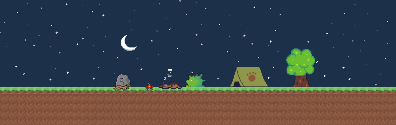

# CanineQuest Website
Canine Quest is a cooperative, 2D platfomer game developed by three seniors at the University of Arizona. This was our capstone project to showcase the skills we've built over our college careers.

## Game Development Team
* Ryan Bailey
* Michelle Monteith
* Andrew Rickus
* <i>Supervisor</i>: Drew Castalia

## Website Development
Website was built by Michelle Monteith in order to show off the game features and give the backstory around the game.

### Features
* Node.js runtime environment with Express web framework
* Utilizes the swearjar package (keeps reviews clear of profanity due to the game's family friendly nature)
* Asynchronous request handling with Ajax 

## Usage

